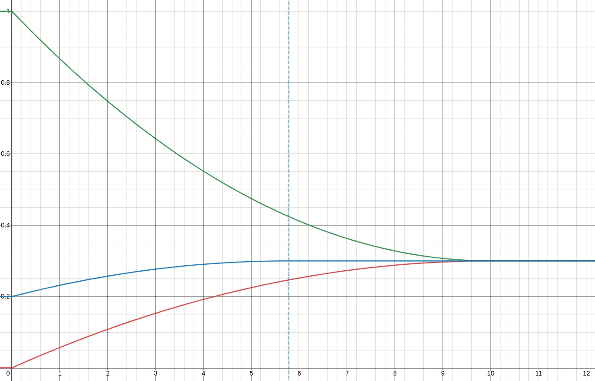
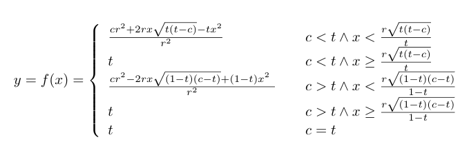

# Dynamic Issuance 

The Dynamic Issuance is an [Aragon App](https://hack.aragon.org/docs/aragonos-building) that implements a Dynamic Supply Policy that can burn and issue tokens automatically. The tokens are usually held on the organization Common Pool (an address controled by the DAO, most likely an Aragon Vault or Agent app)

The Dynamic Supply Policy would work similarly to the previous Issuance Policy in that there will be a public function that anyone can call which would adjust the total supply of the configured token.

However, instead of just issuing the configured token at a fixed rate it will adjust the total supply in order to target a certain percentage of the total supply by either issuing new tokens, or burning tokens.

The mechanism makes adjustments to the supply using a proportional control function where the further from the target the system is the greater the magnitude of adjustment are. You can click on the image to play with a simulation.

The graph shows how the ratio (in the y axis) between the common pool balance and the total supply evolves over time (in hte x axis) when it is deflected from the target ratio (t). As it can be seen, the target ratio is reached again after the recovery time (r).

From a governance perspective this is useful because we can make it significantly more difficult (or impossible) to adjust the throttle and reserve ratio parameters, while allowing more strategic discretion over the outflow rate from the Common Pool (for example using [Conviction Voting](https://github.com/1Hive/conviction-voting-app)).

## Parameter Choice

When installing the app you need to determine which values will be initially used for the `target_ratio`, and `recovery_time`.

`target_ratio` is the ideal fraction of the total supply that should be in the Common Pool.  For example, a value of 0.3 means that 30% of the total supply should ideally be in the Common Pool.

`recovery_time` is the time that takes to the policy to go from 0% to the target ratio.

To help inform your decisions, we highly encourage anyone interested in the topic to [read carefully through this forum post](https://forum.1hive.org/t/dynamic-issuance-policy-v2-from-math-to-code-in-one-post/4214) and get their hands on the model we created to come to help us come to our own decisions.

It’s important to note that all models are imperfect representations of reality but can help to create a better and more robust shared understanding of how we expect the system to behave and make the assumptions we are basing our decisions on more explicit.
Play around with it, if you have question or aren’t familiar with the tooling, you can ask for guidance on [our discord](https://discord.gg/GfqjND7BYS).

## Related Links

[Honey Issuance Policy.](https://forum.1hive.org/t/discussion-honey-issuance-policy/231)

[Dynamic Honey Supply Policy.](https://forum.1hive.org/t/dynamic-honey-supply-policy-proposal/2224)

[Insights on dynamic issuance after modeling it.](https://forum.1hive.org/t/insights-on-dynamic-issuance-after-modeling-it/4187/5)

[Dynamic Issuance Policy v2.](https://forum.1hive.org/t/dynamic-issuance-policy-v2-from-math-to-code-in-one-post/4214)
